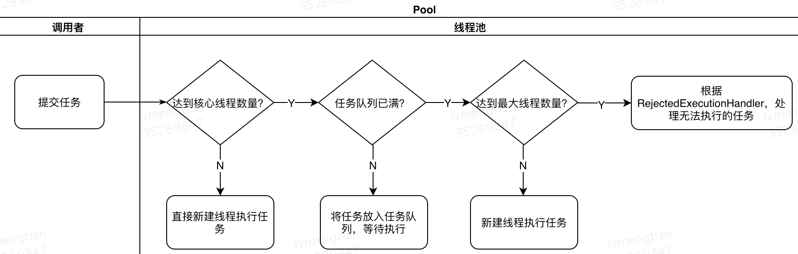

# 线程池概念 
重复管理线程，避免重复的创建销毁线程带来的巨大开销。复用已经创建好的线程，提高效率。
# 线程池创建
创建线程池需要使用到ThreadPoolExecutor
```java
public ThreadPoolExecutor(
    int corePoolSize,    //核心线程的数量
    int maximumPoolSize,    //最大线程数量
    long keepAliveTime,    //超出核心线程数量以外的线程空余存活时间
    TimeUnit unit,    //存活时间的单位
    BlockingQueue<Runnable> workQueue,    //保存待执行任务的队列
    ThreadFactory threadFactory,    //创建新线程使用的工厂
    RejectedExecutionHandler handler // 当任务无法执行时的处理器
) {...}
```
**参数介绍**<br>
|参数名称|描述|
|-|-|
|corePoolSize|核心线程的数量|
|maximumPoolSize|可以创建的最大线程数量。例如线程数已经达到corePoolSize并且任务队列已满，此时可以继续创建线程。maximumPoolSize即是新建线程+核心线程的最大值|
|keepAliveTime|超出核心线程数量以外的线程空余存活时间|
|unit|存活时间(keepAliveTime)的单位|
|workQueue|存储待执行任务的任务队列。如果线程数达到核心线程数量，再有任务时需要将任务放到该队列中等待执行|
|threadFactory|创建新线程时候使用的工厂，可以设置线程名称|
|handler|饱和策略当任务无法执行时的处理器。处理器分为几种：<br>1. **CallerRunsPolicy**：只要线程池没关闭，就直接用调用者所在线程来运行任务<br>2. **AbortPolicy**：抛出RejectedExecutionException异常信息<br>3. **DiscardPolicy**：直接不执行该任务，什么也不做<br>4. **DiscardOldestPolicy**：把队列里待最久的那个任务扔了，然后再调用 execute()<br>实现RejectedExecutionHandler接口，自定义饱和策略。|
# 线程处理任务步骤
线程处理任务的步骤主要是3步：
1. 线程池中的线程数量小于核心线程的数量，来了任务之后就直接新建一个线程执行任务。
2. 线程池中的线程数量达到了核心线程的数量，来了任务之后，如果任务队列没有满，就直接把任务放进任务队列等待执行；如果此时的任务队列也满了，那就需要新建线程来执行任务。
3. 线程池满了(线程池中线程数量达到了最大线程数量)，根据RejectedExecutionHandler处理无法执行的任务。
   
流程图：<br>

# 阻塞队列
当核心线程数已满之后，就需要把任务保存进任务队列。任务队列是一个BlockingQueue，常用的实现有几种：
- **ArrayBlockingQueue:** 基于数组、有界，按 FIFO（先进先出）原则对元素进行排序
- **LinkedBlockingQueue:** 基于链表，按FIFO （先进先出） 排序元素 
  - 吞吐量高于ArrayBlockingQueue
  - Executors.newFixedThreadPool() 使用该队列
- **SynchronousQueue:** 不存储元素的阻塞队列 
  - 吞吐量高于LinkedBlockingQueue
  - 每个插入操作必须等到另一个线程调用移除操作，否则插入操作一直处于阻塞状态
  - Executors.newCacheThreadPool()使用该队列
- **PriorityBlockingQueue:** 具有优先级的阻塞队列
# JDK提供的线程池
## newFixedThreadPool
```java
public static ExecutorService newFixedThreadPool(int nThreads) {
    return new ThreadPoolExecutor(nThreads, nThreads, 0L, TimeUnit.MILLISECONDS,
        new LinkedBlockingQueue<Runnable>());
}
```
通过源码可以看到newFixedThreadPool中核心线程数量和最大线程数量是相等的，使用的阻塞队列是LinkedBlockingQueue，容量是Integer.MAX_VALUE，所以可以一直增加任务。(所以使用newFixedThreadPool时一定要特别注意内存问题，稍不注意就可以能发送内存泄漏)<br>
**用于负载比较重的服务器，为了资源的合理利用，需要限制当前线程数量。**

## newSingleThreadExecutor
```java
public static ExecutorService newSingleThreadExecutor() {
        return new FinalizableDelegatedExecutorService
            (new ThreadPoolExecutor(1, 1, 0L, TimeUnit.MILLISECONDS, new LinkedBlockingQueue<Runnable>()));
    }
```
newSingleThreadExecutor的核心线程数和最大线程数都是1，说明就是一个线程执行。阻塞队列是LinkedBlockingQueue，默认容量是Integer.MAX_VALUE。 等同于 Executors.newFixedThreadPoll(1)<br>
**用于串行执行任务的场景，每个任务必须按顺序执行，不需要并发执行。**

## newCachedThreadPool
```java
public static ExecutorService newCachedThreadPool() {
    return new ThreadPoolExecutor(0, Integer.MAX_VALUE, 60L, TimeUnit.SECONDS,
        new SynchronousQueue<Runnable>());
    }
```
newCachedThreadPool的核心线程数是0，最大线程数是无限的，所以只要有任务就会新建一个线程。当一个线程空闲时间超过60s时，就需要被销毁。<br>
**用于并发执行大量短期的小任务，或者是负载较轻的服务器。**

## newScheduledThreadPool
```java
public static ScheduledExecutorService newScheduledThreadPool(int corePoolSize) {
  return new ScheduledThreadPoolExecutor(corePoolSize);
}
public ScheduledThreadPoolExecutor(int corePoolSize) {
  super(corePoolSize, Integer.MAX_VALUE, 0, NANOSECONDS, new DelayedWorkQueue());
}
```
**newScheduledThreadPool使用的是延时队列，常用来执行定时任务。**
# 两种提交任务的方法
## executor
```java
public void execute(Runnable command) {...}
```
executor()的参数是Runnable，没有返回值，不确定任务执行成功还是失败。
## submit
```java
public Future<?> submit(Runnable task) {...}

public <T> Future<T> submit(Runnable task, T result) {...}

public <T> Future<T> submit(Callable<T> task) {...}
```
submit有三个重载，同时它会返回一个 Funture 对象，通过它我们可以判断任务是否执行成功。<br>
获得执行结果调用 Future.get() 方法，这个方法会阻塞当前线程直到任务完成

