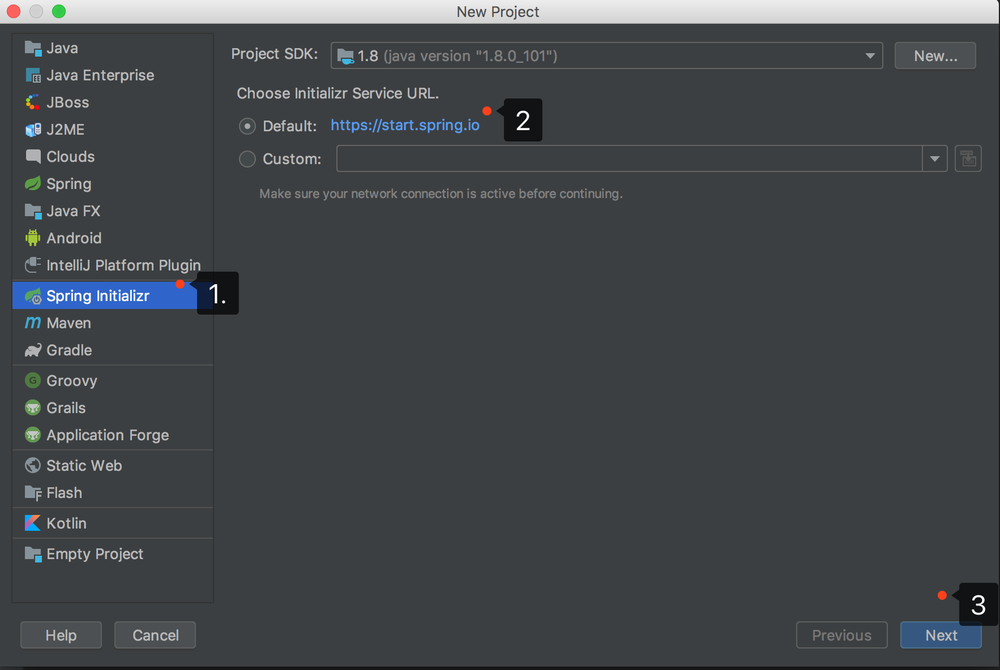
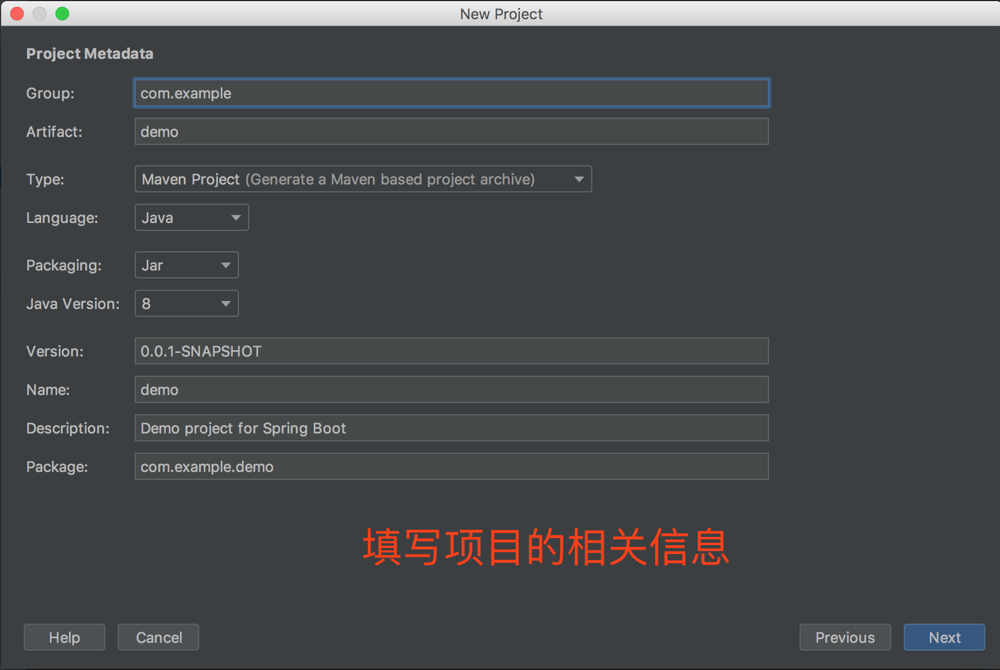
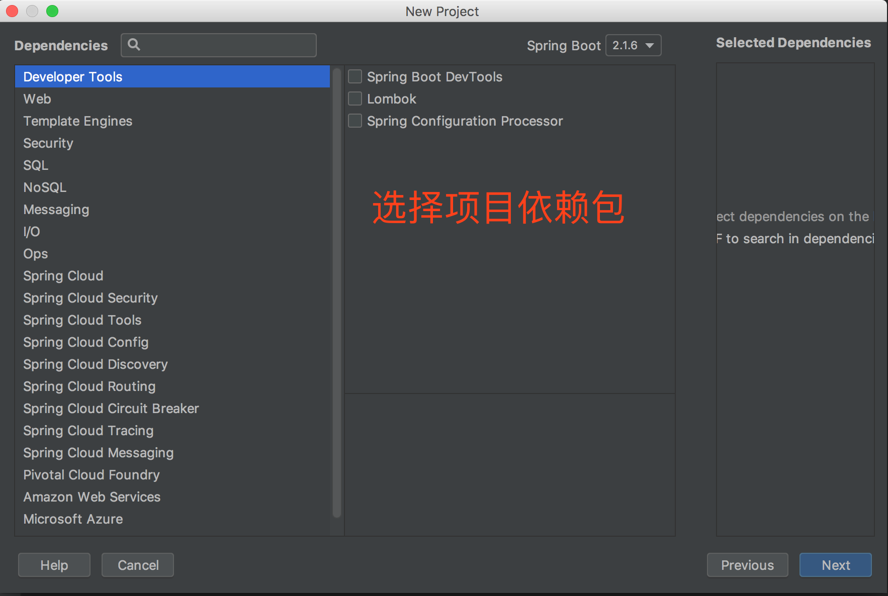
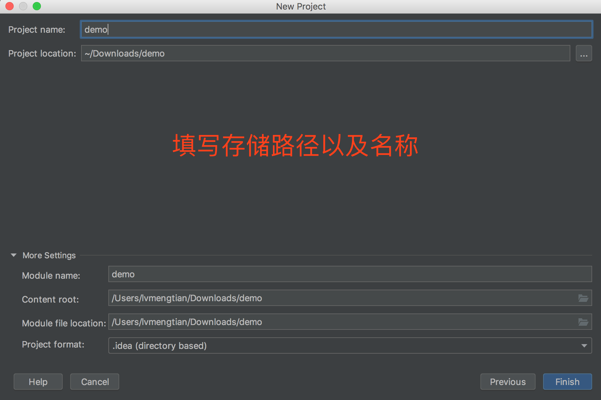

本文介绍如何创建一个SpringBoot项目，其中包括了mybatis的集成。
# 创建一个SpringBoot项目
## 第一步：选择SpringBoot

## 第二步：填写项目相关信息
Group：项目的group id<br>
Artifact：项目名称<br>
Type：类型，选择Maven即可<br>
Language：开发语言<br>
Packaging：最终是打成jar包还是war包。<br>
Java Version：java版本<br>
Version：项目版本<br>

## 第三步：选择项目依赖的jar包
根据自己所需勾选需要依赖的jar，在此处也可以不选，进入pom.xml自己添加所依赖的jar包也可。

## 第四步：选择存储位置以及创建结束

既然使用了Spring Boot，我们就抛弃xml的一些配置吧。接下来讲一下项目创建好之后的一些配置。
# 配置application.yml
> 项目构建完成之后会生成一个 application.properties的配置文件，但是个人总喜欢使用yaml文件。依据个人喜好进行配置文件格式选择。
```yml
# 服务端口
server:
  port: 8080

# mysql
spring:
  datasource:
    username: ${username}
    password: ${password}
    driver-class-name: com.mysql.cj.jdbc.Driver
    url: jdbc:mysql://127.0.0.1:3306/${db}

# mybatis(配置映射文件xml路径，以及实体类的包)
mybatis:
  mapper-locations: classpath:mapper/*.xml
  type-aliases-package: com.me.catering.domain
```
# 创建映射xml文件
> mybatis提供了映射xml文件，也提供了注解的形式。根据个人喜好选择xml形式或者注解形式。
```xml
<?xml version="1.0" encoding="UTF-8"?>
<!DOCTYPE mapper
  PUBLIC "-//mybatis.org//DTD Mapper 3.0//EN"
  "http://mybatis.org/dtd/mybatis-3-mapper.dtd">
<mapper namespace="com.me.catering.dao.TestDao">
  <select id="checkLogin" parameterType="String" resultType="int">
    select count(1)
    from login_info
    where login_name = #{loginName}
      and login_pwd = #{loginPwd}
  </select>
</mapper>
```
# 创建dao层接口
> dao层接口应该与第二步的xml进行对应。上文中的namespace="com.me.catering.dao.TestDao"，说明该接口是TestDao.java，包:com.me.catering
```java
@Repository
public interface TestDao {
    //方法名与上文中xml中的<select>标签的id对应。
    int checkLogin(@Param("loginName") String loginName, @Param("loginPwd") String loginPwd);
}
```
# 添加@MapperScan注解
> 扫描包，将带有@Repository注解的类注册成Spring的bean
```java
@SpringBootApplication
@MapperScan("com.me.catering.dao")
public class CateringApplication {
  public static void main(String[] args) {
    SpringApplication.run(CateringApplication.class, args);
  }
}
```
至此大功告成，代码可以运行了。